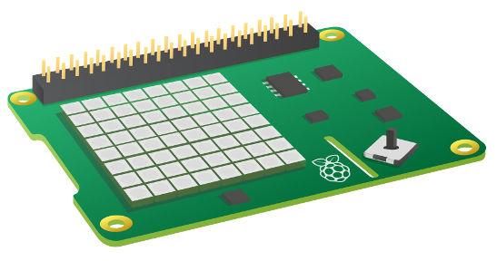

<link rel="stylesheet" href="bootstrap/css/bootstrap.min.css">


Introduction to the Sense HAT
========


The Sense HAT is a jam packed HAT (Hardware Attachment on Top) for the Raspberry Pi. It contains an 8x8 pixel full RGB LED matrix, along with an array of sensors/inputs including a joystick, humidity sensor and even a gyroscope.   
The HAT was initially designed for the Astro Pi project, but be used for so much more than just space!   
   
In this activity, you will learn the basics of using the Sense HAT in Python 3. This activity is simply a brief overview though, there is a lot more you can use the board for, especially when combined with other activities.

<div class="page-break"></div>

## Boilerplate code   
Each section below requires the following lines at the start of your program.   
```Python
from sense_hat import SenseHat

sense = SenseHat()
```   
This code is super simple, basically we first need to import the SenseHat module from the sense_hat library, so we can use it. Then we set up a new SenseHat() object for us to talk to control from Python.


## LED Matrix   
The Sense HAT includes a rather awesome full RGB (Red, Green and Blue) array 8x8 pixels. Each pixel can be individually programmed to be any colour you want!   
The SenseHat library includes a number of built in functions so you don't though have to individually code each LED if you don't want.   
**For example, to scroll some text across the screen, you could use.**   
Make sure not to use the same message though!
``` Python
from sense_hat import SenseHat

sense = SenseHat()

sense.show_message("NI Raspberry Jam is awesome!")
```

The ```show_message``` function also includes some extra ```parameters```, for example.   
``` Python
from sense_hat import SenseHat

sense = SenseHat()

sense.show_message("NI Raspberry Jam is awesome!", scroll_speed=0.05, text_colour=[255,255,0], back_colour=[0,0,255])
```   
 

# Displaying an image   
As well as scrolling text across the screen, you can also display an image that you have designed pixel by pixel.  
To do that, we need to first as usual add our boilerplane code, plus them as well, define some colours below it.   

```python
from sense_hat import SenseHat
from time import sleep

sense = SenseHat()

w = [150, 150, 150]
b = [0, 0, 255]
```

Then, add the actual image array itself below that. It is simply an 8x8 list of letters which correspond to the values defined below. **Try changing it when you add it to your program.**   
``` python
image = [
e,e,e,e,e,e,e,e,
e,e,e,e,e,e,e,e,
w,w,w,e,e,w,w,w,
w,w,b,e,e,w,w,b,
w,w,w,e,e,w,w,w,
e,e,e,e,e,e,e,e,
e,e,e,e,e,e,e,e,
e,e,e,e,e,e,e,e
]
```
Finally, update the pixel display to your new ```image```.
``` python
sense.set_pixels(image)
```

# Sensing
The Sense HAT comes with a number of built in inputs/sensors a gyroscope, magnetometer (digital compass), accelerometer
